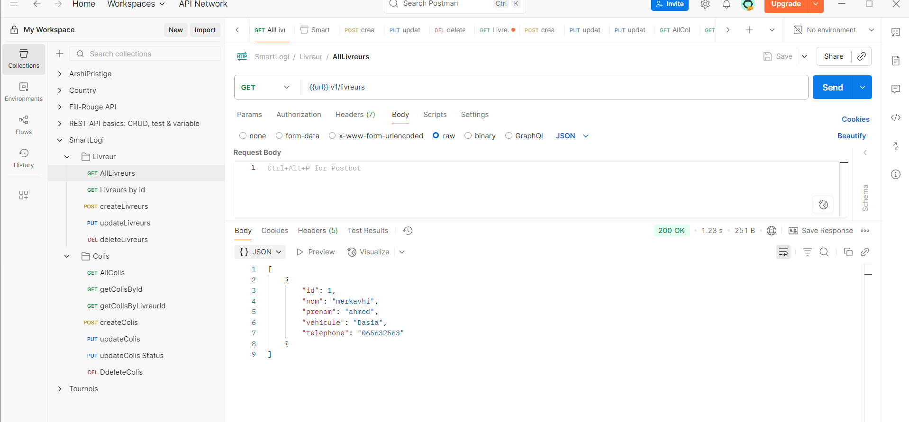
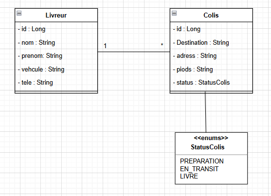
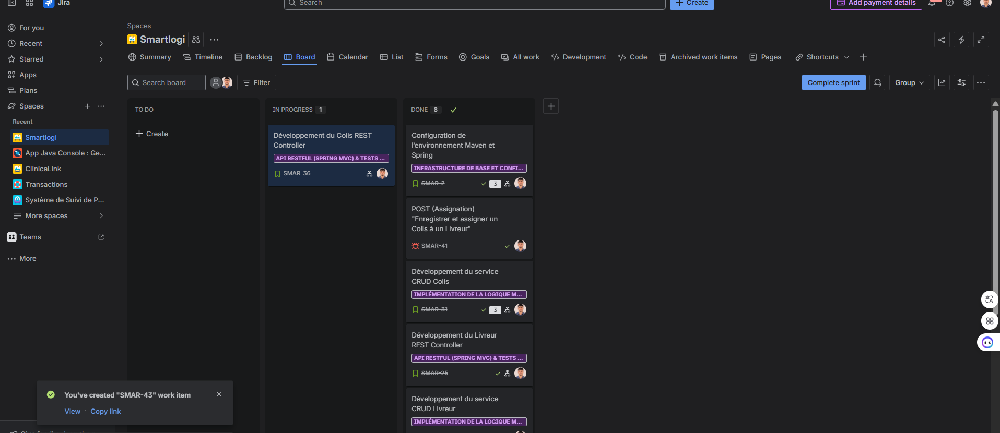

# 🚚 Smart Delivery Management System – Système de Gestion des Livraisons

### Modernisez la logistique des colis avec une application Spring 6/JPA centralisée et une API REST performante.

-----

## 🌟 Contexte du Projet

La société **SmartLogi** cherche à remplacer son système de suivi manuel (fichiers Excel et registres papier) par une **solution centralisée** pour améliorer la précision, la fiabilité et l’efficacité de ses opérations logistiques (gestion des Livreur et des Colis).

Les principaux objectifs sont :

- **Éviter les erreurs de saisie** et les doublons de colis.
- **Améliorer la planification** et la visibilité en temps réel.
- **Centraliser** les données des livreurs et des livraisons.

-----

## 🏛️ Architecture de l’Application

Ce projet est basé sur une architecture en couches (Layered Architecture) utilisant **Spring Core** pour l'inversion de contrôle (IoC/DI) et **Spring Data JPA** pour la persistance.

- **Couche Présentation (Controller/Menu)** : Initialement une interface console (`App.main()`) pour les tests, étendue à une **API REST** pour la gestion finale (Bonus).
- **Couche Service (Métier)** : Contient le cœur du projet (validation, implémentation des User Stories) et gère les **Transactions** (`@Transactional`).
- **Couche DAO / Repository** : Accès aux données via **Spring Data JPA** (Interfaces), qui génère l'implémentation CRUD automatiquement.
- **Couche Entity** : Objets persistants (`Livreur`, `Colis`).
- **Couche DTO** : Objets de transfert de données (`LivreurDto`, `ColisDto`) pour une API propre et sécurisée.

-----

## 🛠️ Fonctionnalités Implémentées (User Stories)

| Entité | Fonctionnalité (User Story) | Description Technique |
| :--- | :--- | :--- |
| **Livreur** | Gérer les Livreur (CRUD) | Création, Lecture, Mise à jour, Suppression de Livreur. Recherche par Téléphone et Véhicule (Query Methods). |
| **Colis** | Enregistrer et Assigner | Création d'un colis avec lien obligatoire vers un Livreur existant (vérification d'intégrité). |
| **Colis** | Mise à jour du Statut | Mise à jour de l'état du colis (PREPARATION, EN\_TRANSIT, LIVRE) via un Enum. |
| **Colis** | Lister par Livreur | Récupération de tous les colis assignés à un Livreur spécifique (pour planification de tournée). |

-----

## 🚀 Technologies Utilisées

| Technologie | Rôle dans le Projet |
| :--- | :--- |
| **Java 17 / Maven** | Langage de base et gestion de projet (dépendances, compilation). |
| **Spring Core (XML)** | Gestion des **Beans** (IoC) et **Injection de Dépendances (Constructor Injection)**. |
| **Spring Data JPA** | Suppression du code CRUD manuel. Génération automatique des Repositories. |
| **Hibernate ORM 6** | Implémentation concrète de la spécification JPA. |
| **PostgreSQL** | Base de données relationnelle pour la persistance des données. |
| **Spring MVC (Bonus)** | Création des Controllers et gestion des requêtes **API REST**. |
| **Tomcat Embedded** | Serveur Web intégré pour lancer l'API directement depuis la méthode `main()`. |

-----

## 📂 Structure Détaillée du Projet

```plaintext
📁 SmartLogi/
├── pom.xml                   (Configuration Maven et Dépendances)
├── src/main/java/
│   ├── io.github.Mahjoubech.smartlogi/
│   │   ├── App.java           (Tomcat Embedded Launcher / Ancien Menu Console)
│   │   ├── controller/        (Controllers API REST)
│   │   ├── dao/               (LivreurDao, ColisDao - Interfaces JpaRepository)
│   │   ├── dto/               (LivreurDto, ColisDto)
│   │   ├── entity/            (Livreur, Colis - Entities JPA)
│   │   ├── service/           (LivreurService, ColisService - Interfaces Métier)
│   │   └── service/impl/      (LivreurServiceImpl, ColisServiceImpl - Logique Métier)
├── src/main/resources/
│   └── application-context.xml (Configuration Spring Core, JPA et Beans)
└── src/test/java/
    └── io.github.Mahjoubech.smartlogi/
        └── service/           (LivreurServiceImpTest - Tests Unitaires/Intégration)
```

-----

## 💻 Guide de Démarrage (API REST)

Pour lancer le serveur et tester les endpoints avec Postman:

1.  **Compiler et Installer:**
    ```bash
    mvn clean install
    ```
2.  **Démarrer l'API (via le code Java):**
    Exécutez la méthode **`main()`** de la classe **`io.github.Mahjoubech.smartlogi.App`**.
    (Ceci lance Tomcat Embedded sur le port `8080`).

### 📸 Test Postman

| Action | Méthode | URL                                          | Statut Attendu |
| :--- | :--- |:---------------------------------------------| :--- |
| **Créer Livreur** | `POST` | `http://localhost:8080/api/v1/livreurs`      | `201 Created` |
| **Lister Livreur** | `GET` | `http://localhost:8080/api/v1/livreurs`      | `200 OK` |
| **Mettre à jour** | `PUT` | `http://localhost:8080/api/v1/livreurs/{id}` | `200 OK` / `404 Not Found` |
| **Créer Colis** | `POST` | `http://localhost:8080/api/c1/colis`         | `201 Created` |
### Screenshots des requêtes Postman :

-----

## 🗂️ Documentation et Suivi

### 📊 Diagramme UML des Classes


### 📋 Suivi de Projet (JIRA/Trello)



-----

## 📬 Contact

Pour toute question ou problème d'exécution, veuillez contacter l'auteur.

-----